## Architecture overview

This document contains our intial idea about the architecture diragram that we have researched upon. We have chosen event driven microservices architecture for this sytem.

**NOTE**: This diagram is not fixed and may be subject to several changes in the future. Everyone in the team should verify the architecture and update this document if necessary.

## Diagram overview

I have pasted a mermaid live diagram of the architecture. You can view this in [Mermaid Live](https://mermaid.live) by pasting the raw codeblock or you can directly view it in github!

```mermaid
graph TB
    %% --- Color Styles & Themes ---
    classDef clientStyle fill:#e1f5fe,stroke:#03a9f4,stroke-width:2px,color:#000;
    classDef gatewayStyle fill:#f3e5f5,stroke:#9c27b0,stroke-width:2px,color:#000;
    classDef serviceStyle fill:#e8f5e9,stroke:#4caf50,stroke-width:2px,color:#000;
    classDef billingStyle fill:#e0f7fa,stroke:#00bcd4,stroke-width:2px,color:#000;
    classDef engineStyle fill:#fff3e0,stroke:#ff9800,stroke-width:2px,color:#000;
    classDef redisStyle fill:#ffebee,stroke:#f44336,stroke-width:2px,color:#000;
    classDef kafkaStyle fill:#eceff1,stroke:#607d8b,stroke-width:2px,color:#000;
    classDef dbStyle fill:#ede7f6,stroke:#673ab7,stroke-width:2px,color:#000;
    classDef aiStyle fill:#f9fbe7,stroke:#c0ca33,stroke-width:2px,color:#000;
    classDef monitorStyle fill:#fffde7,stroke:#ffd54f,stroke-width:2px,color:#000;

    %% --- Layers Configuration ---
    subgraph EXTERNAL_LAYER ["External Clients & IoT Devices"]
        ClientMobile["Mobile Client<br/>(Prosumers & Traders)"]:::clientStyle
        ClientWeb["Web Client<br/>(Prosumers & Traders)"]:::clientStyle
        Meters["Simulated Smart Meters<br/>(IoT Ticks)"]:::clientStyle
        Mosquitto["MQTT Broker<br/>(Mosquitto)"]:::gatewayStyle
    end

    subgraph API_SERVICES_LAYER ["Core API & Services Layer (gRPC Communication)"]
        Gateway["API Gateway<br/>(Fastify / Node.js)"]:::gatewayStyle
        Auth["Auth Service<br/>(Fastify / Node.js)"]:::serviceStyle
        OMS["Order Management (OMS)<br/>(Node.js)"]:::serviceStyle
        Billing["Billing & Settlement<br/>(Go / Node.js)"]:::billingStyle
        Ticker["Market Data / Ticker<br/>(Node.js)"]:::serviceStyle
        Notify["Notification Service<br/>(Node.js)"]:::serviceStyle
        Admin["Admin Service<br/>(Fastify / Node.js)"]:::serviceStyle
    end

    subgraph CACHE_LAYER ["In-Memory Cache & Pub/Sub Layer"]
        Redis[("Redis Memory Store<br/>• Order Book Cache<br/>• Rate Limiter<br/>• WS Pub/Sub")]:::redisStyle
    end

    subgraph MESSAGING_SPINE ["Central Data & Messaging Spine (Apache Kafka)"]
        subgraph Kafka_Topics ["Named Kafka Topics"]
            T_Orders["orders"]
            T_Trades["trades"]
            T_Telemetry["telemetry"]
            T_Alerts["price-alerts"]
        end
        Connector["Kafka Connect<br/>MQTT Source Connector"]:::kafkaStyle
    end

    subgraph ENGINE_LAYER ["Matching Engine Layer"]
        Engine["Go Matching Engine<br/>• Pure In-Memory Book<br/>• Sub-100ms Latency"]:::engineStyle
    end

    subgraph DATA_STORAGE_LAYER ["Data Storage & Analytics Layers"]
        Postgres[("Primary Relational DB<br/>(PostgreSQL + Prisma)")]:::dbStyle
        Timescale[("Time-Series & Historical<br/>(TimescaleDB)")]:::dbStyle
        Analytics["Batch Analytics<br/>(Spark / dbt)"]:::dbStyle
        S3[("Cold Data Lake<br/>(S3 / MinIO)")]:::dbStyle
    end

    subgraph AI_FORECASTING_LAYER ["AI/ML & Forecasting Box"]
        AI_Engine["AI Forecasting Engine<br/>(FastAPI / Python)"]:::aiStyle
        Models["Prophet / LSTM Models<br/>• Price & Demand Forecasts"]:::aiStyle
    end

    subgraph OBSERVABILITY_LAYER ["System Observability & Monitoring"]
        Prometheus["Prometheus Database<br/>(Scrapes System Metrics)"]:::monitorStyle
        Grafana["Grafana Visualization<br/>(Operational Dashboards)"]:::monitorStyle
    end

    %% --- Operational Data Flows & Connections ---
    
    %% IoT / Telemetry Pipeline
    Meters -->|"Publish Ticks"| Mosquitto
    Mosquitto -->|"Streamed Telemetry via Pipe"| Connector
    Connector --> T_Telemetry
    T_Telemetry --> Ticker
    T_Telemetry -.-> Timescale

    %% Client Frontend Entry & Trading Pipeline
    ClientWeb -->|"WebSockets / REST"| Gateway
    ClientMobile -->|"WebSockets / REST"| Gateway
    Gateway -->|"gRPC (Rate Limit Check)"| Redis
    Gateway -->|"gRPC"| Auth
    Gateway -->|"gRPC (Validated Order)"| OMS
    
    OMS -->|"Write PENDING State"| Postgres
    OMS -->|"Publish Event"| T_Orders
    
    %% Core Matching Pipeline
    T_Orders -->|"Consumes"| Engine
    Engine -->|"Publish Execution"| T_Trades
    
    %% Post-Trade Clearing & Market Data Dissemination
    T_Trades -->|"Consumes"| Billing
    T_Trades -->|"Consumes"| Ticker
    
    Billing -->|"Update Financial Ledger"| Postgres
    Ticker -->|"Update Live Snapshots"| Redis
    
    %% Notifications Alert Pipeline
    Ticker -.->|"Identify Alert Condition"| T_Alerts
    T_Alerts --> Notify
    Notify -->|"Expo Push Notifications"| ClientMobile

    %% Machine Learning Data Pipeline
    Timescale --> Analytics
    Analytics --> S3
    Postgres -.->|"User Context"| AI_Engine
    S3 -.->|"Historical OHLCV Training Data"| Models
    AI_Engine --- Models
    AI_Engine -->|"gRPC Forecasts"| Gateway

    %% Observability Scrape Loops (No storage lines to prevent clutter)
    Gateway -.->|"Metrics Scrape"| Prometheus
    Kafka_Topics -.->|"Lag Monitoring"| Prometheus
    Engine -.->|"Latency Scrape"| Prometheus
    Prometheus -->|"Metrics Query"| Grafana
    
    %% Note: Grafana pulls out-of-band directly from Prometheus & TimescaleDB
    Timescale -.->|"Logically Queried by"| Grafana

    %% --- Structural Subgraph Layout Ties ---
    OMS --> Redis
    Admin --> Postgres
```

