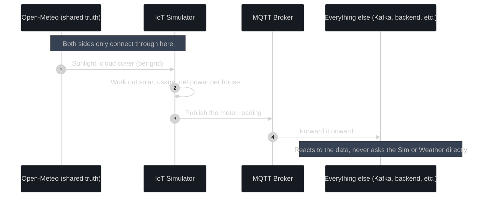

# IOT Simulation Quick Infos

## IoT simulation indirect reactivity

**NOTE:** The following was previously researched and better ways are found instead of the following method

### 1. Previously researched info regarding this

This was the hardest problem to figure out, so it gets explained slowly.

#### 1.1 The two ways that don't work

**The simulator could watch the trading system, and react to it.** For example: "the matching engine just made a big trade, so let me bump up generation to match." This sounds tempting, but it's backwards. In real life, a meter has no idea what price electricity is selling for — it just reports what's physically happening. If we built it this way, it would also break completely the moment we swapped in real hardware, since real meters obviously can't query our matching engine.

**The simulator could just send random numbers, completely disconnected from anything.** This also sounds simple, but it ruins the whole point of the demo. If solar output is just noise, then nothing the matching engine does is meaningful — and we specifically want to show "a cloud rolls over, supply drops, and the price goes up." Pure randomness can't produce that, because there's no real concept of "a cloud is currently over this specific zone."

#### 1.2 The approach that does work: both sides watch the same outside thing

Instead of the simulator and the trading system talking to each other, they both independently react to the **same outside source of truth** — the weather.

Think about it like this: in real life, a smart meter and a power company's backend both observe the same physical grid. Neither one is getting its information from the other — they're both just observing the same reality. That's exactly what we copy here.

So concretely:

- The **weather model** (from Open-Meteo, or the clear-sky fallback) is the one shared "truth" that drives everything.
- The simulator turns that weather, plus each house's own attributes, into meter readings — adding its own randomness on top.
- The trading system never sees weather data at all. It only ever sees the meter readings that get published, exactly like it would with real hardware.
- When a cloud passes over a grid, every house in that grid is affected at the same time, because they're all reading from the same weather signal — just with their own bit of independent noise. That naturally creates a believable, connected dip across many meters at once, which is what makes a resulting price move on the trading side feel real instead of staged.

This is what "indirect reactivity" means here: the two systems are connected through **shared reality**, not through **one calling the other**. Nothing about the simulator needs to know a trading system exists, and nothing about the trading system needs to know a simulator exists either.



#### 1.3 Is this the right approach?

Yes — and this isn't just our own guess. Real digital-twin and simulation setups for smart grids use exactly this pattern: an independent simulation of the physical world feeding data into a separate market or control system through a message queue, never through a direct function call between the two. We're following a known, safe pattern here, not inventing something fragile.

---

### 2. New approach for indirect reactivity

**NOTE**: I had small misunderstanding of energy flow vs system. Actually the above point is correct. The smart meters need not update based on every trade. It needs to update only for houses with energy storage (bettery, EVs configured).

So the indirect reactivity is only for houses that have energy storage mediums.

#### 2.1 Why the above proposed method won't work for houses with energy storage mediums?

The below scenario:

* The Scenario: `house0042` has a battery at `battery_soc_pct: 100%`.

* The Trade: The trading system matches a buyer, confirming a trade where `house0042` agrees to discharge its battery at 2 kW to the grid for the next hour.

* The Flaw: Because the simulator has no idea this trade happened, it keeps blindly generating numbers based only on its archetype curve and weather noise. On the next tick, it reports `battery_soc_pct: 100%` again.

* The Result: The house has sold energy on paper, but its simulated physical battery never drains. It has successfully generated "ghost energy" and can keep selling the exact same capacity over and over again. The system's market accounting is now completely detached from physical reality.

#### 2.2 Correct solution

Simply, the backend should send actuation commands down to the simulator via MQTT. Minimal logic and the backend is not deeply coupled with the IoT simulation.

1. Keep the Simulator Isolated
1. Introduce inbound topics for specific device
1. The backend (or dispatch manager) calculates the physical consequence and publishes an adjustment command (dispatch schedule command) to MQTT. Example command:

    ```
    {
        "command": "set_battery_rate_kw",
        "target_kw": -2.0, 
        "duration_seconds": 3600
    }
    ```

NOTE: This is how real world works. The system publishes an command over mqtt but in real world there is an important distinctions like there are some more layers these commands are passed or mapped before hitting the hardware. For simulation we will simplify this and just use the command to charge/discharge!