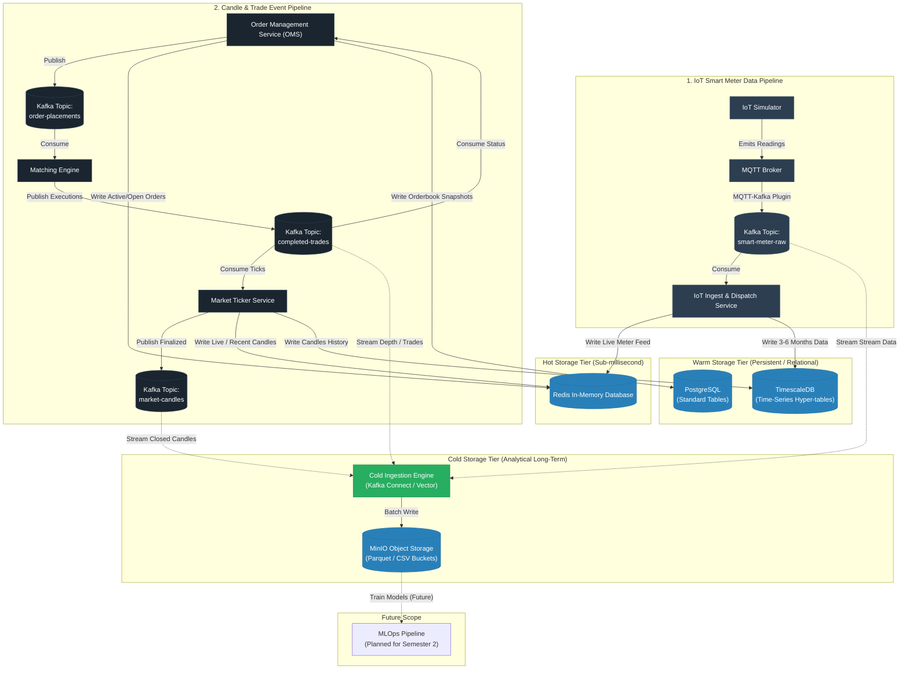

## Diagram overview

**NOTE**: Does not include the complete system or plan. All kafka and redis topic/key names mentioned in this diagram are not finalized

```mermaid
graph TD
    %% 1. IoT SMART METER PIPELINE SUBGRAPH
    subgraph IoTPipeline ["1. IoT Smart Meter Data Pipeline"]
        IoTSim["IoT Simulator"] -->|"Emits Readings"| MQTT["MQTT Broker"]
        MQTT -->|"MQTT-Kafka Plugin"| KafkaIoT[("Kafka Topic:<br>smart-meter-raw")]
        KafkaIoT -->|"Consume"| IoTDispatch["IoT Ingest & Dispatch Service"]
    end

    %% 2. CANDLE & TRADE EVENT PIPELINE SUBGRAPH
    subgraph TradePipeline ["2. Candle & Trade Event Pipeline"]
        OMS["Order Management Service (OMS)"] -->|"Publish"| KafkaOrders[("Kafka Topic:<br>order-placements")]
        KafkaOrders -->|"Consume"| ME["Matching Engine"]
        ME -->|"Publish Executions"| KafkaTrades[("Kafka Topic:<br>completed-trades")]
        
        KafkaTrades -->|"Consume Status"| OMS
        KafkaTrades -->|"Consume Ticks"| MTS["Market Ticker Service"]
        
        MTS -->|"Publish Finalized"| KafkaCandles[("Kafka Topic:<br>market-candles")]
    end

    %% 3. STORAGE TIERS BOUNDARIES
    subgraph HotLayer ["Hot Storage Tier (Sub-millisecond)"]
        Redis[("Redis In-Memory Database")]
    end

    subgraph WarmLayer ["Warm Storage Tier (Persistent / Relational)"]
        Timescale[("TimescaleDB<br>(Time-Series Hyper-tables)")]
        Postgres[("PostgreSQL<br>(Standard Tables)")]
    end

    subgraph ColdLayer ["Cold Storage Tier (Analytical Long-Term)"]
        SinkTool["Cold Ingestion Engine<br>(Kafka Connect / Vector)"]
        MinIO[("MinIO Object Storage<br>(Parquet / CSV Buckets)")]
        SinkTool -->|"Batch Write"| MinIO
    end

    subgraph FutureLayer ["Future Scope"]
        MLOps["MLOps Pipeline<br>(Planned for Semester 2)"]
    end

    %% PIPELINE INTERACTION WITH STORAGE TIERS
    %% IoT Mappings
    IoTDispatch -->|"Write Live Meter Feed"| Redis
    IoTDispatch -->|"Write 3-6 Months Data"| Timescale

    %% Trading Mappings
    OMS -->|"Write Active/Open Orders"| Redis
    OMS -->|"Write Orderbook Snapshots"| Postgres
    MTS -->|"Write Live / Recent Candles"| Redis
    MTS -->|"Write Candles History"| Timescale

    %% Decoupled Cold Storage Streams
    KafkaIoT -.->|"Stream Stream Data"| SinkTool
    KafkaTrades -.->|"Stream Depth / Trades"| SinkTool
    KafkaCandles -.->|"Stream Closed Candles"| SinkTool

    %% Analytical Read
    MinIO -.->|"Train Models (Future)"| MLOps

    %% Style Formatting
    classDef iotStyle fill:#2c3e50,stroke:#34495e,color:#fff;
    classDef tradeStyle fill:#1a252f,stroke:#2c3e50,color:#fff;
    classDef storageStyle fill:#2980b9,stroke:#2471a3,color:#fff;
    classDef toolStyle fill:#27ae60,stroke:#1e8449,color:#fff;
    
    class IoTSim,MQTT,KafkaIoT,IoTDispatch iotStyle;
    class OMS,KafkaOrders,ME,KafkaTrades,MTS,KafkaCandles tradeStyle;
    class Redis,Timescale,Postgres,MinIO storageStyle;
    class SinkTool toolStyle;
```
