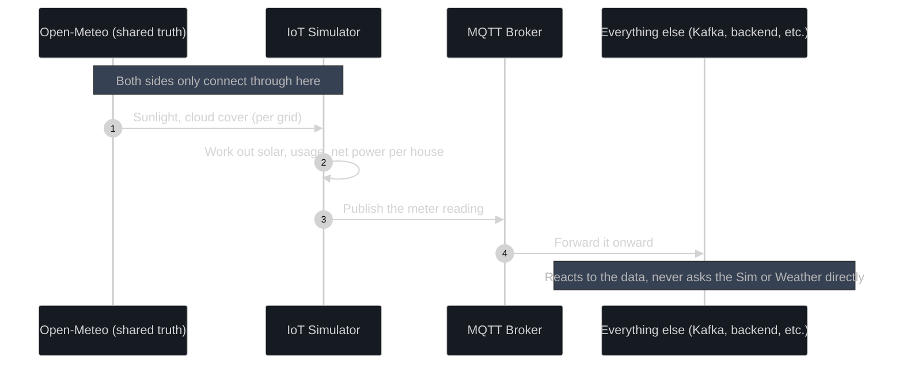

# IoT Simulator Plan

**Author:** Hanan (M.S.H. Ahmed)
**Scope:** IoT Simulator module only. Smart meters, houses, load, solar, weather.
**Stack:** Node.js + TypeScript, MQTT (Mosquitto)
**Status:** Draft v2

---

## 1. What this simulator does

The IoT simulator pretends to be the real world. It pretends to be houses with solar panels, and the smart meters attached to them. Its only job is to make up realistic energy numbers and publish them over MQTT.

That is it. It does not place orders. It does not know prices. It does not talk to the matching engine, the backend, Kafka, or any database that belongs to the trading system. It only knows about houses, weather, and electricity.

Why this rule matters: one day we might replace this simulator with real smart meters such as an ESP32 chip. If that happens, nothing else in the system should need to change. A real meter cannot call our matching engine. It just reports numbers. So our simulator has to behave the same way, even though it is fake.

Keep this one sentence in mind for the rest of the document: **the simulator only reports what is happening in its pretend physical world. It never reaches into the trading system.**

---

## 2. What data it sends

Every meter sends one JSON message per tick. A tick is one reading, sent every 5 seconds. There are three kinds of meters, based on what kind of house they are attached to:

- **`consumer`** is a normal house with no solar panels. It only uses electricity.
- **`residential_prosumer`** is a house with solar panels. It can produce and use electricity.
- **`commercial`** is a bigger generator, like a small solar farm or a factory rooftop. It works the same way as a prosumer but with much larger numbers. More on this in section 4.

### 2.1 The meter reading

This is the main message. It gets sent every tick.

```json
{
  "schema_version": "1.0",
  "meter_id": "meter-grid01-house0042",
  "house_id": "house0042",
  "grid_id": "grid01",
  "device_class": "residential_prosumer",
  "timestamp": "2026-06-16T09:30:05Z",
  "seq": 184231,
  "readings": {
    "solar_kw": 2.41,
    "consumption_kw": 0.87,
    "net_kw": 1.54,
    "battery_soc_pct": 63.5,
    "battery_kw": -0.30
  },
  "meta": {
    "weather_irradiance_wm2": 612.0,
    "cloud_cover_pct": 18
  }
}
```

A few things to know about these fields:

**`net_kw`** is just `solar_kw - consumption_kw`, plus a small contribution from the battery if there is one. A positive number means the house has surplus power to sell. A negative number means it needs to buy. This is exactly what a real smart meter would calculate.

**Battery fields:** if a house has no battery, we leave out `battery_soc_pct` and `battery_kw` completely instead of sending zero. That way there is no confusion between a house with no battery and a house whose battery happens to be idle.

**`meta` block:** this is extra debug information. It lets us check that solar output makes sense given the weather without calling the weather API again. Nothing downstream should depend on this block existing.

**`schema_version`:** this exists so that if we change the format later, nothing breaks silently.

### 2.2 The heartbeat

Every minute or so, each meter also sends a smaller message that announces its existence and basic details.

```json
{
  "schema_version": "1.0",
  "grid_id": "grid01",
  "house_id": "house0042",
  "meter_id": "meter-grid01-house0042",
  "status": "online",
  "device_class": "residential_prosumer",
  "has_battery": true,
  "rated_solar_kw": 5.0,
  "rated_battery_kwh": 10.0
}
```

The purpose of this message is so that anyone listening to MQTT can figure out what houses exist and what they are capable of. The simulator never needs to tell anyone directly.

---

## 3. Where the weather comes from

We use **Open-Meteo** (open-meteo.com). It is free, does not need an API key, and has generous rate limits. This was already decided and stays the same.

We call this endpoint: `GET https://api.open-meteo.com/v1/forecast`

The fields we actually care about:

- **`shortwave_radiation`** is how much sunlight is hitting the ground, measured in W/m². This is the main number we use.
- **`direct_radiation`** and **`diffuse_radiation`** are slightly more detailed sunlight numbers. These are useful later if we want to model panel angle more precisely.
- **`cloud_cover`** is the percentage of sky covered in cloud.
- **`temperature_2m`** is air temperature, which slightly affects how efficient solar panels are.

One thing to be careful of: these are hourly averages looking backward. The number for 9am is the average over the hour before 9am, not the exact value at 9am. We should not treat it as an instantaneous reading.

Here is how we actually use it:

1. Every grid (zone) gets a fixed location with a latitude and longitude.
2. One small background process per grid checks Open-Meteo every 15 to 30 minutes. We do not need to check more often because the underlying weather forecast does not change minute to minute. Only our own simulated noise changes that fast.
3. Each house works out its own solar output using this formula:

   `solar_kw = rated_solar_kw × (irradiance / 1000) × panel_efficiency_factor`

   A small bit of random noise is added on top so that two houses under the same sky do not produce identical numbers. More on this in section 4.6.

4. If Open-Meteo is down or unreachable, we fall back to a simple clear-sky model. This is basically a sine-wave shape based on time of day, so the simulation keeps running instead of breaking.

---

## 4. Building the world: grids, houses, and meters

### 4.1 Why we use more than one grid

A grid is a zone, a small group of houses that trade locally with each other. If we only had one giant pool of houses, the whole idea of trading with people near you would not show up anywhere. That idea is central to the project. Multiple grids are also cheap to set up now and painful to add later, so we build this in from day one.

### 4.2 How a grid is structured

```
Grid (e.g. "grid01")
 └── Houses (a mix of consumers, prosumers, and commercial generators)
      └── Every house has: 1 Smart Meter, 1 Load simulator
      └── Prosumer and commercial houses also have: 1 Solar simulator
      └── Some of those also have: 1 Battery simulator (optional)
```

A basic consumer house has two components: a Load simulator and a Smart Meter. A prosumer house with a battery has four: Solar, Load, Battery, and the Smart Meter that ties them together. Weather is shared across the whole grid and is not duplicated per house.

### 4.3 Houses are not all the same size

We do not just simulate households. A grid can also have a commercial generator such as a small solar farm or a co-op installation that sells a lot more power than any single house. This matters because it makes the order book more interesting. Instead of only small sell orders, we also get the occasional large one.

A commercial entity is not a special case in code. It uses the exact same Smart Meter, Solar, Load, and Battery classes as a normal house. Only the numbers are bigger:

| Type | What it is | Typical solar size | Load pattern |
|---|---|---|---|
| `consumer` | Normal house with no solar | none | Household pattern |
| `residential_prosumer` | House with solar panels | 2 to 8 kW | Household pattern |
| `commercial` | Small farm, factory rooftop, or co-op | 50 to 300 kW | Office pattern: quiet at night, busy 9 to 5 |

### 4.4 Everything is set by config, not hardcoded

We define grids, how many houses they have, and what mix of house types they have in a config file rather than in code. Adding a new grid or changing how many houses exist is a one-line change to the file, not a code change.

```yaml
grids:
  - grid_id: grid01
    location: { lat: 6.9271, lon: 79.8612 }   # Colombo, as a placeholder
    houses: 50
    prosumer_ratio: 0.4
    battery_ratio: 0.5       # of the prosumers, how many also have a battery
    commercial_count: 2      # separate from the ratio above
  - grid_id: grid02
    location: { lat: 9.6615, lon: 80.0255 }   # Jaffna, as a placeholder
    houses: 30
    prosumer_ratio: 0.3
```

This means scaling up later, whether that is more grids, more houses, or something like a UAE-style setup with many zones, is just a config change. Each `grid_id` already behaves like its own independent zone.

### 4.5 Making houses use different amounts of electricity

If every house followed the exact same usage pattern, the data would look obviously fake. Real households use electricity differently depending on who lives there and what their day looks like: quiet at night, busy in the morning, dipping during the day if everyone is out, then peaking in the evening.

We build this with three simple layers stacked together:

`consumption_kw = archetype_curve(hour_of_day) × house_scale_factor × (1 + noise)`

**The archetype** defines what shape this house's day follows. We pick from a small fixed list: `apartment_single` for quiet households with small peaks, `family_both_work` for households that are quiet all day with a sharp evening peak, `family_home_daytime` for steady use all day with small morning and evening bumps, `large_house` for higher usage throughout the day, and `commercial_daytime` for entities that are quiet at night and busy during work hours.

**The scale factor** is how big this household's overall usage is. We pick this number once when the house is created and never change it. Smaller houses get a smaller number, bigger ones get a bigger number.

**The noise** is small random jitter added every tick so the numbers are not perfectly smooth. This mimics appliances switching on and off in real life.

Each house picks one archetype and one scale factor when it is created and keeps them for as long as the simulator runs:

```yaml
house_id: house0042
device_class: residential_prosumer
load_archetype: family_both_work
load_scale_factor: 1.34
```

Whether archetypes get assigned completely at random, or deliberately balanced to guarantee a specific mix per grid, is still an open question. See section 10.

### 4.6 Making solar output different between houses

All houses in the same grid share one weather reading. We do not call the weather API separately for every house. So if every house has the same sun, why would two houses produce different amounts of solar power? Because the houses themselves are different, not the weather:

`solar_kw = shared_grid_irradiance × (rated_solar_kw / 1000) × panel_efficiency_factor × (1 + house_noise)`

**Shared grid irradiance** is the one number from section 3. It is the same for every house in this grid at this moment.

**Rated solar size** is how big this house's panels are. Bigger houses or commercial entities simply have a bigger number here.

**Panel efficiency** represents things like panel angle, shading, or how well-maintained the panels are. We pick this once per house when it is created.

**House noise** is small random jitter representing things a shared weather number cannot capture, like a cloud shadow that passes over one roof but not the one next door.

A house's stored details end up looking like this:

```yaml
house_id: house0042
device_class: residential_prosumer
rated_solar_kw: 5.0
panel_efficiency_factor: 0.88
```

### 4.7 Houses keep the same ID forever

A house's ID such as `house0042` and its meter's ID are fixed when the house is first created. They do not change if we restart the simulator. This matters for section 6 because the rest of the system needs to recognise the same house every time rather than think a new one appeared after every restart.

---

## 5. How the simulator and the trading system stay in sync without talking to each other

This was the hardest problem to figure out, so it gets explained slowly.

### 5.1 The two ways that do not work

**Option one: the simulator watches the trading system and reacts to it.** For example, the matching engine just made a big trade, so the simulator bumps up generation to match. This sounds tempting but it is backwards. In real life a meter has no idea what price electricity is selling for. It just reports what is physically happening. If we built it this way, it would also break completely the moment we swapped in real hardware, since real meters cannot query our matching engine.

**Option two: the simulator sends random numbers completely disconnected from anything.** This sounds simple but it ruins the whole point of the demo. If solar output is just noise, then nothing the matching engine does is meaningful. We specifically want to show that a cloud rolls over, supply drops, and the price goes up. Pure randomness cannot produce that because there is no real concept of a cloud currently over a specific zone.

### 5.2 The approach that works: both sides watch the same outside thing

Instead of the simulator and the trading system talking to each other, they both independently react to the same outside source of truth: the weather.

Think about it like this. In real life, a smart meter and a power company's backend both observe the same physical grid. Neither one gets its information from the other. They are both just observing the same reality. That is exactly what we copy here.

Concretely:

The weather model from Open-Meteo or the clear-sky fallback is the one shared truth that drives everything. The simulator turns that weather, plus each house's own attributes, into meter readings with its own randomness added on top. The trading system never sees weather data at all. It only ever sees the meter readings that get published, exactly like it would with real hardware. When a cloud passes over a grid, every house in that grid is affected at the same time because they all read from the same weather signal with their own independent noise. That naturally creates a believable dip across many meters at once, which is what makes a resulting price move on the trading side feel real rather than staged.

This is what indirect reactivity means here. The two systems are connected through shared reality, not through one calling the other. Nothing about the simulator needs to know a trading system exists, and nothing about the trading system needs to know a simulator exists either.



### 5.3 Is this the right approach?

Yes, and this is not just our own guess. Real digital twin and simulation setups for smart grids use exactly this pattern: an independent simulation of the physical world feeds data into a separate market or control system through a message queue, never through a direct function call between the two. We are following a known, safe pattern rather than inventing something fragile.

---

## 6. Two separate memories, not one shared one

The simulator and the real backend system must each keep their own separate record of houses and grids. They should describe the same things using the same shape, but they must never read from the same source.

**The simulator's own memory** is something simple it keeps for itself, like an in-memory map or a small local file. It holds all the houses, grids, and their live state such as current battery charge. This is the simulator's private picture of its own pretend world.

**The backend's own memory** is its own database, built up by listening to MQTT traffic over time. It learns that a house exists because it sees that house's heartbeat or readings arrive. It does not peek into the simulator's files or memory directly.

Both sides agree on what a house or grid looks like, meaning the same fields and the same IDs, so they are clearly talking about the same things. But each side fills in that picture independently from its own observations. This mirrors real life: a power company's customer records and a meter's own firmware both know the meter exists, but neither one reads the other's database.

The only way the simulator talks to anything outside itself is through the MQTT broker. There are no shared files, no shared database connections, and no direct callbacks from the simulator into the backend. This single rule is what keeps the whole design honest.

A useful side effect of this: if a house ID ever shows up on one side but never on the other, that is a real bug signal. It is the same as a mismatch in a real meter inventory would be.

---

## 7. Where we are simplifying compared to the real world

| In real life | What we do instead | Why |
|---|---|---|
| Real solar panel and inverter with real sunlight | Open-Meteo sunlight times panel size times efficiency | We skip panel aging, exact shading, and fine temperature effects |
| Real meters sample every few seconds but often only send data every 5 to 15 minutes to save bandwidth | We send every tick immediately every 5 seconds | We do not need to save bandwidth since MQTT is cheap for us |
| Real household usage shaped by actual appliances and people coming and going | A daily pattern plus random noise picked per house | Good enough realism without modelling individual appliances |
| Real batteries have chemistry, losses, and degrade over time | Simple charge tracking with one fixed efficiency number | Battery chemistry is not needed for what we are demonstrating |
| Real meters report through cellular networks or Zigbee | We use MQTT | It is the right level of detail, and real hardware can also speak MQTT later if we switch |
| Real weather changes smoothly across a whole area | One shared reading per grid refreshed periodically | Close enough; we fake the small moment-to-moment changes with noise |

The general idea is this: where it is cheap to do the real thing properly, such as weather-driven solar, MQTT, and calculating net power correctly, we do it properly. Where the real thing needs hardware-level detail we do not actually need for this project, such as battery chemistry and individual appliances, we simplify in a way that could be made more detailed later without a rewrite.

---

## 8. How the project is organised in code

**Language:** TypeScript. This gives us compile-time safety on the JSON shapes from section 2 and the house config fields from section 4. That is useful once more than one person is editing this codebase.

```
iot-simulator/
├── package.json
├── tsconfig.json
├── .eslintrc.json
├── config/
│   └── grids.yaml                  # all grid and house settings, see section 4.4
├── src/
│   ├── index.ts                    # starts everything up
│   ├── config/
│   │   └── loadConfig.ts
│   ├── weather/
│   │   ├── openMeteoClient.ts       # calls Open-Meteo, one call per grid
│   │   ├── clearSkyFallback.ts      # backup model if Open-Meteo is down
│   │   └── weatherProvider.ts       # picks live data or fallback
│   ├── domain/
│   │   ├── Grid.ts
│   │   ├── House.ts
│   │   ├── SolarSimulator.ts
│   │   ├── LoadSimulator.ts          # archetype and scale factor logic, section 4.5 
│   │   ├── FlexibleAssetSimulator.ts  # Holds asset details (batter, ev)
│   │   └── SmartMeter.ts            # combines everything into one reading
│   ├── mqtt/
│   │   ├── mqttClient.ts            # connecting and reconnecting
│   │   └── topics.ts                # topic naming, e.g. gridx/{grid_id}/{house_id}/meter
│   ├── scheduler/
│   │   └── tickLoop.ts              # decides when each meter publishes
│   ├── store/
│   │   └── simState.ts              # the simulator's own memory, see section 6
│   └── types/
│       ├── payloads.ts              # the exact shapes from section 2
│       └── config.ts                # the exact shapes from section 4
├── test/
│   └── ...                         # tests for each piece above
└── README.md
```

One thing to notice on purpose: there is no folder for Kafka, no folder for backend, and no folder for clients. The only place this code talks to the outside world is `mqtt/`. If someone is ever tempted to add a shortcut straight to the backend, there is nowhere natural in this structure for that code to live. That is intentional.

---

## 9. What we need to prove: evaluation targets

This section lists only the targets that the IoT simulator is directly responsible for. These come from the project's evaluation plan which covers the whole system. The targets below are the slice that belongs to this module.

### 9.1 What the evaluators will ask about the simulator

The evaluation panel will check whether the data pipeline can handle real load. The IoT simulator is the thing generating that load. It is the source of all the meter events that flow into the rest of the system. So the simulator needs to produce enough realistic and well-structured data to let the pipeline prove itself.

On top of that, the simulator has its own separate pass, merit, and distinction targets for multi-grid behaviour. These are explained in section 9.3.

### 9.2 The specific numbers we need to hit

| What is being measured | Target | Notes |
|---|---|---|
| Publish frequency | Every 5 seconds per meter, configurable | This is the tick rate agreed in section 4.4 |
| Minimum concurrent meters | At least 50 MQTT publishers running at the same time | Spread across at least 3 separate grid zones |
| Minimum grid zones | At least 3, each with its own independent solar curve | Each zone must behave differently and not just be copies of each other |
| Solar curve realism | The solar output must visibly peak at midday and drop at dusk | This should be visible on the price chart downstream |
| MQTT delivery guarantee | Zero missed messages with QoS 1 at-least-once delivery confirmed | QoS 1 means the broker confirms every message was received |
| Zone isolation | A message from Zone A must never appear in Zone B | The simulator enforces this by keeping grids strictly separate |
| Price coupling | A supply drop must produce a visible price rise within 10 seconds on the chart | The simulator causes this indirectly through the weather signal. See section 5. |

### 9.3 Pass, merit, and distinction levels

These are the three grading levels defined for the IoT multi-grid module.

**Pass** means at least one zone is working and publishing real meter readings.

**Merit** means all three zones are running and behaving independently from each other with different solar curves and different load patterns.

**Distinction** means the price in the different zones visibly diverges on the chart because each zone has genuinely different supply conditions at the same moment.

The distinction target is the most important one to understand. It is not just about having three grids running. It is about demonstrating that different weather, caused by each grid having a different location in the config, produces different supply and therefore different prices in each zone. This is the whole point of running multiple grids instead of one, and it only works if the indirect reactivity approach from section 5 is implemented correctly.

### 9.4 How we test these targets

**Unit tests** cover the solar curve shape to check it peaks at midday and drops at dusk, the load archetype curves to check they follow the right daily shape, and the net power calculation to confirm that `net_kw = solar_kw - consumption_kw` is always correct.

**Integration tests** check that a reading published by the simulator over MQTT actually arrives at the broker without being dropped. These run with QoS 1 enabled and confirm every message is acknowledged.

**Load test** starts at least 50 meter instances across 3 grids simultaneously and checks that all of them keep publishing at the correct 5-second interval without falling behind or dropping messages.

**Realism check** runs the simulator for at least one simulated day and inspects the solar curve shape. The output must be clearly higher at midday than at dawn or dusk. This can be done by plotting the data in Grafana or a simple script.

**Zone isolation check** confirms that each grid's readings carry the correct `grid_id` and that no reading from grid01 has a `grid_id` of grid02 or vice versa.

The load testing tool is k6. Unit and integration tests use Jest with ts-jest. The realism and isolation checks can be done with a Grafana dashboard or a short test script.

---

## 10. Things we still need to decide as a team

- Exact tick speed for each meter type. We are assuming 5 seconds for the main reading, but should solar and load update faster internally even if the meter only reports every 5 seconds?
- How many grids and houses to actually run by default for the demo. This is a config value, not a code decision.
- Should house archetypes from section 4.5 be assigned completely randomly, or should we guarantee a specific mix per grid?
- Should `commercial_count` be a fixed number per grid, or a ratio like `prosumer_ratio`?
- Should the `meta` block from section 2.1 be removed before we consider this final? A real meter would not know the weather, only its own output.
- We need to agree on the exact MQTT topic names with whoever builds the Kafka bridge, so both sides agree independently rather than guessing each other's format.