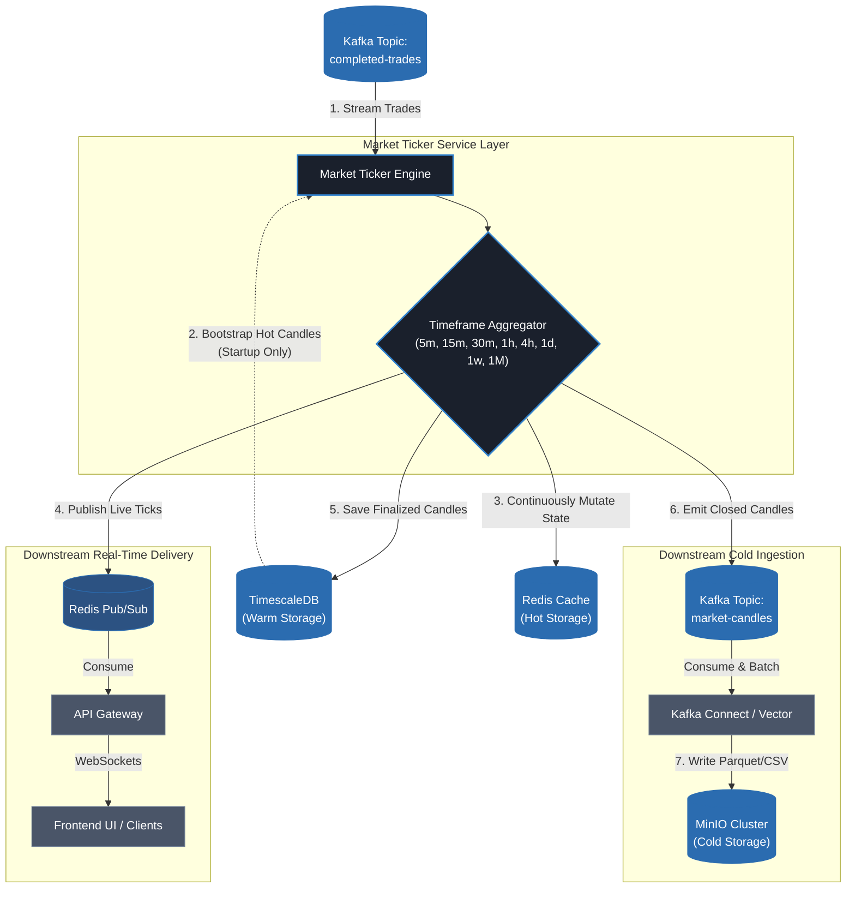

# Introduction to Market Ticker Service

This service handles listening to closed trades from a kafka topic and tehn formulating candles for real time, hot and warm storage as well as pushing the candles back to kafka so it will be later stored in cold storage by appropriate tools.

### What this service does?

1. Listen to closed trades from kafka topics and formulate candles for particular set of timeframes (timeframes are not decided)
1. Load hot candles from timescaledb for all accepted timeframes into redis during startup (Number of hot candles is not decided yet)
1. Keep the above hot candles updated with newly formed candles
1. Simultaneously publish live candle updates to redis pub/sub topic so that can be consumed by api gateway which will then open a websocket to frontend to stream live candles in real time.
1. This service also stores formed candles in timescaledb for recent historical data fetching
1. Pushes formed candles to apache kafka topic (this will later be consumed by plugin that directly batches and stores them on minio)

### Data format

Example of a 15 minute live candle:

```json
{
    "open_time": 1782504000, // Epoch timestamp (seconds) when this 15-minute window started (Ex: 14:00:00)
    "close_time": 1782504899, // Epoch timestamp (seconds) when this window ends (Ex: 14:14:59)
    "is_closed": false, // 'false' means this candle is live and still changing shape with every new peer trade
    "open": 14.50, // Price of the very first energy trade executed at the start of this 15-minute window
    "high": 18.25, // Highest matched rate during the window (Ex: during a peak demand cloud-cover event)
    "low": 12.10, // Lowest matched rate during the window (Ex: peak sunshine, excess solar supply)
    "close": 15.10, // The final execution price or the official market settlement rate for this block
    "volume": 2450.75, // Total volume of electrical energy successfully traded/delivered, measured in kWh
    "trade_count": 142 // (optional: might not be needed, I am unsure)
}
```

### Timeframes

**NOTE**: Not finalized

* 5 minute
* 15 minute
* 30 minute
* 1 hour
* 4 hours
* 1 day
* 1 week
* 1 month

### Example flow of data

This is not finalized and does not include the full deep view.

**NOTE:** All kafka and redis topic/key names mentioned in this diagram are not finalized



