# Matching Engine Workflow

## Purpose

This document explains how the Matching Engine processes incoming orders and generates completed trades.

---

## High Level Flow

```mermaid
flowchart LR

%% ===========================
%% External
%% ===========================

OS["Order Service"]
KO[(Kafka<br/>orders)]

OS -->|Publish Order Event| KO

%% ===========================
%% Matching Engine
%% ===========================

subgraph ME["Matching Engine"]

A["1. Consume Order"]
B["2. Basic Validation"]
C{"3. Order Type"}

D["4A. Market Order<br/>Find Best Match"]

E["4B. Limit Order<br/>Search Order Book"]

F{"Match Found?"}

G["5. Generate Trade"]

H["6. Update Order Book"]

I["7. Update Order Status"]

J["8. Publish Trade Event"]

K["Store Order<br/>in Order Book"]

end

%% ===========================
%% Downstream
%% ===========================

KT[(Kafka<br/>trade-events)]

MD["Market Data"]
SS["Settlement"]
NS["Notification"]

%% ===========================
%% Flow
%% ===========================

KO --> A

A --> B

B --> C

C -->|Market| D

C -->|Limit| E

D --> G

E --> F

F -->|Yes| G

F -->|No| K

K --> I

G --> H

H --> I

I --> J

J --> KT

KT --> MD

KT --> SS

KT --> NS

%% ===========================
%% Colors
%% ===========================

style OS fill:#FFE5B4,stroke:#CC8A00,stroke-width:2px

style KO fill:#E9D8FD,stroke:#7C3AED,stroke-width:2px
style KT fill:#E9D8FD,stroke:#7C3AED,stroke-width:2px

style A fill:#DBEAFE
style B fill:#DBEAFE
style C fill:#FEE2E2
style D fill:#DCFCE7
style E fill:#DCFCE7
style F fill:#FEE2E2
style G fill:#FEF3C7
style H fill:#EDE9FE
style I fill:#DBEAFE
style J fill:#FDE68A
style K fill:#EDE9FE

style MD fill:#FCE7F3
style SS fill:#FCE7F3
style NS fill:#FCE7F3
```



---

## Flow Explanation

### 1. Order Service

The Order Service validates the request and publishes an order event to Kafka.

---

### 2. Consume Order

The Matching Engine consumes the order event from Kafka.

---

### 3. Basic Validation

The engine performs basic validation such as:

* Valid order type
* Valid quantity
* Valid price
* Valid grid zone
* Valid delivery slot
* Delivery slot is within the supported 30-minute slot structure
* Order has not already expired
* Required fields

Business validation should already be completed by the Order Service.

---

### 4. Select Market Book

After validation, the Matching Engine selects the Market Book using the order's delivery slot and product type.

For the initial implementation:

```text
Market Book = delivery_slot_start + ENERGY
```

Each delivery slot is fixed to 30 minutes.

Example:

```text
Market Book: ENERGY / 10:00–10:30
```

The order's grid zone is still stored, but it is used as the participant location, not as the only matching boundary.

---

### 5. Determine Order Type

The engine checks whether the order is:

* Market Order
* Limit Order

Each order type follows a different matching process.

---

### 6. Match Order

If matching conditions are satisfied, the engine searches the selected Market Book.

The engine first identifies eligible opposite-side orders from the same delivery slot. These orders may be from the same grid zone or from another grid zone if the Grid Transfer Policy allows cross-zone transfer.

Cross-zone matching uses effective price:

```text
BUY matching:  seller_price + grid_fee <= buyer_limit_price
SELL matching: seller_price <= buyer_limit_price - grid_fee
```

The matcher selects orders using Effective-Price-Time Priority.

---

### 7. Add to Order Book

If a limit order cannot be fully matched immediately, its remaining quantity is added to the Zone Order Book inside the selected Market Book.

The order remains active only for its 30-minute delivery slot. If the delivery slot ends before the order is fully matched, the remaining quantity expires.

---

### 8. Generate Trade

When a successful match occurs, one or more trade records are created.

---

### 9. Update Order Book

After matching:

* Reduce remaining quantity
* Remove completed orders
* Keep partially filled orders
* Add remaining limit orders if required

---

### 10. Update Order Status

Order status is updated.

Examples:

* OPEN
* PARTIALLY_FILLED
* FILLED
* CANCELLED
* EXPIRED

---

### 11. Publish Events

The Matching Engine publishes trade and order update events to Kafka.

Other services consume these events independently.

---

## Matching Rules

The Matching Engine should follow these rules:

* Orders are matched only within the same 30-minute delivery slot
* Cross-zone matching is allowed only when Grid Transfer Policy allows it
* Same-zone matching has zero grid fee
* Cross-zone matching includes grid fee in the effective price
* Effective-Price-Time Priority
* Highest effective buy price has priority
* Lowest effective sell price has priority
* Earlier orders have priority when effective prices are equal
* Support partial fills
* Support multiple trades from a single order
* Expire unmatched remaining quantity when the delivery slot ends

---

## Notes

* This document describes the planned workflow.
* The implementation details may change during development.
* Some components such as the matching algorithm and order book design will be documented separately.
