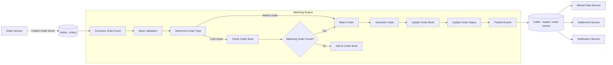

# Matching Engine Workflow

## Purpose

This document explains how the Matching Engine processes incoming orders and generates completed trades.

---

## High Level Flow

---

## Flow Explanation

### 1. Order Service

The Order Service validates the request and publishes an order event to Kafka.

---

### 2. Consume Order

The Matching Engine consumes the order event from Kafka.

---

### 3. Basic Validation

The engine performs basic validation such as:

* Valid order type
* Valid quantity
* Valid price
* Required fields

Business validation should already be completed by the Order Service.

---

### 4. Determine Order Type

The engine checks whether the order is:

* Market Order
* Limit Order

Each order type follows a different matching process.

---

### 5. Match Order

If matching conditions are satisfied, the engine searches the order book and performs matching using the matching algorithm.

---

### 6. Add to Order Book

If a limit order cannot be matched immediately, it is added to the order book and waits for a future matching order.

---

### 7. Generate Trade

When a successful match occurs, one or more trade records are created.

---

### 8. Update Order Book

After matching:

* Reduce remaining quantity
* Remove completed orders
* Keep partially filled orders
* Add remaining limit orders if required

---

### 9. Update Order Status

Order status is updated.

Examples:

* OPEN
* PARTIALLY_FILLED
* FILLED
* CANCELLED

---

### 10. Publish Events

The Matching Engine publishes trade and order update events to Kafka.

Other services consume these events independently.

---

## Matching Rules

The Matching Engine should follow these rules:

* Price-Time Priority
* Highest Buy Price has priority
* Lowest Sell Price has priority
* Earlier orders have priority when prices are equal
* Support partial fills
* Support multiple trades from a single order

---

## Notes

* This document describes the planned workflow.
* The implementation details may change during development.
* Some components such as the matching algorithm and order book design will be documented separately.
