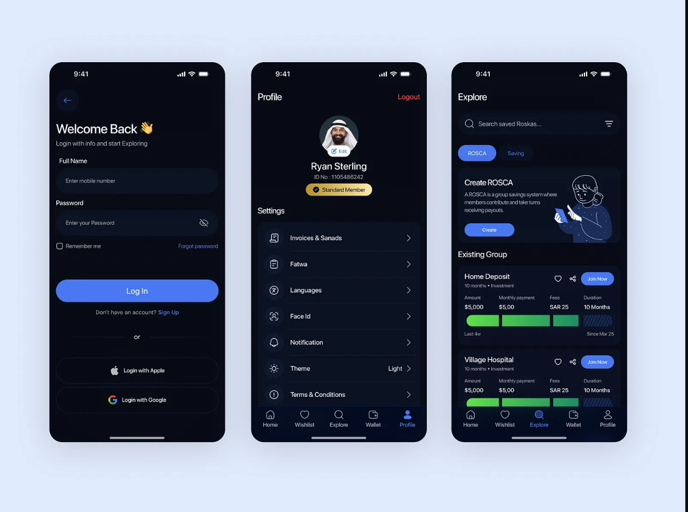
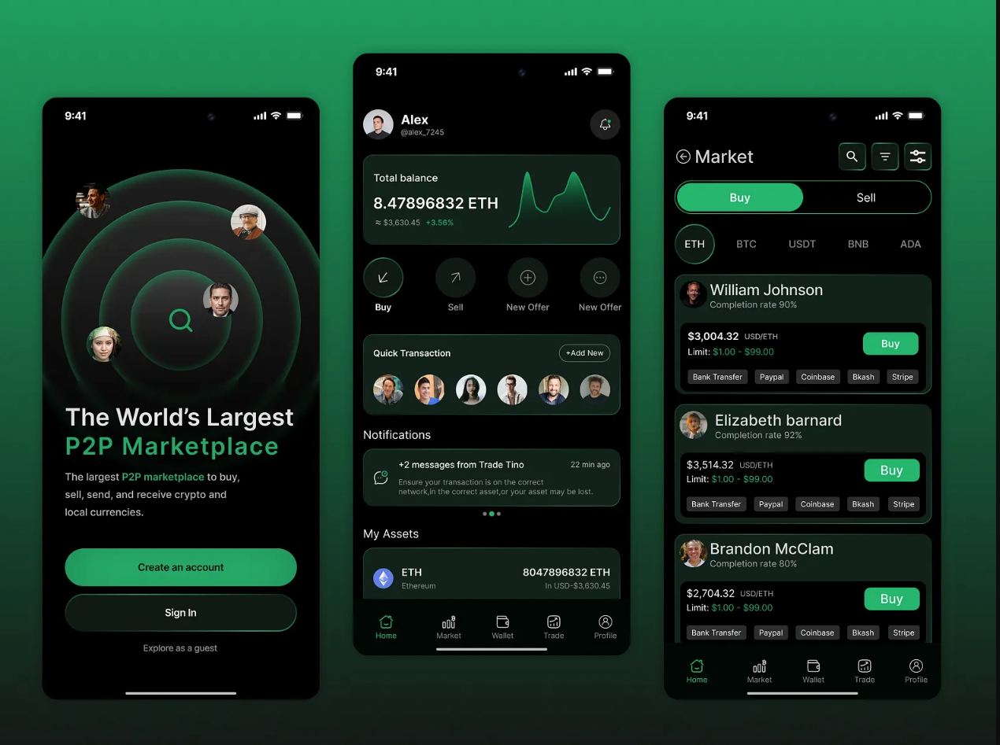
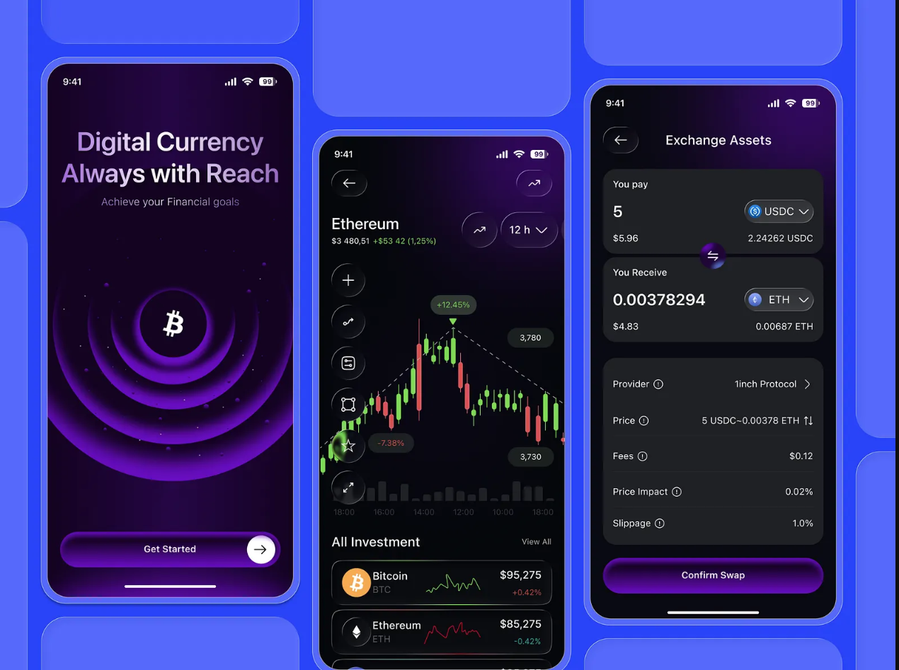
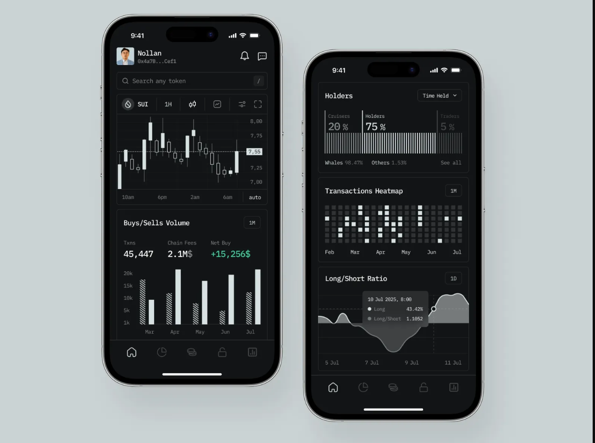
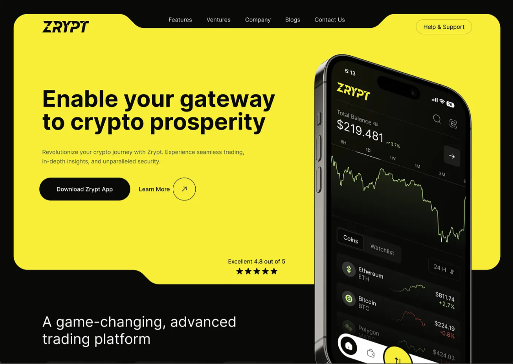
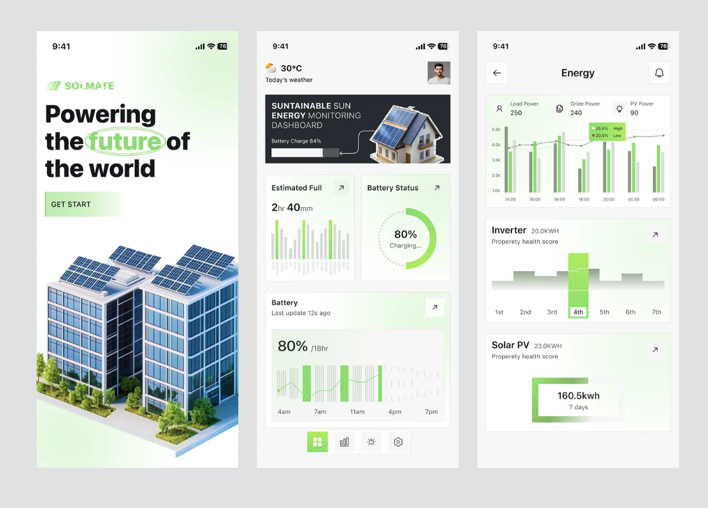

# Mobile App - UI Screen 

**Platform:** iOS / Android (React Native - Expo)
----------
##  Design Overview & Theme Strategy

###  Vision

GridX mobile app is designed to be **clean, modern, and focused** — removing distractions so users can quickly check energy prices, monitor solar generation, and execute trades in seconds. The design emphasizes **real-time data clarity** and **instant decision-making**.

###  Design Philosophy

- **Real-time first**: Large, legible price displays update instantly

- **Action-oriented**: Primary CTAs are always visible and tap-able

- **Minimal friction**: 3-5 taps to place a trade

- **Data-driven**: Show what matters (price, generation, earnings)

- **Dark-friendly**: Optimized for both day and night usage patterns

###  Color Palette Strategy
####  Light Mode (Daytime)
``` 
Background: White (#FFFFFF)

Surface: Light Gray (#F5F5F5)

Primary: Energy Green (#1D9E75) - for solar/positive actions

Secondary: Sky Blue (#378ADD) - for information/neutral

Accent Warning: Sunset Amber (#BA7517) - for price rises

Accent Danger: Coral Red (#D85A30) - for price drops

Text Primary: Dark Gray (#1A1A1A)

Text Secondary: Medium Gray (#666666)

Border: Light Gray (#EEEEEE)

 ``` 

####  Dark Mode (Night)

``` 

Background: Very Dark Gray (#0D1117)

Surface: Dark Gray (#161B22)

Primary: Energy Green (#1D9E75) - same, stays bright

Secondary: Sky Blue (#5BA3FF) - lighter for contrast

Accent Warning: Sunset Amber (#EF9F27) - brighter for dark bg

Accent Danger: Coral Red (#F0997B) - brighter for dark bg

Text Primary: White (#FFFFFF)

Text Secondary: Light Gray (#A0A0A0)

Border: Dark Gray (#30363D)

 ``` 

**Why this approach?**

- Green/Blue are color-blind friendly (80% of color-blind users distinguish these)

- Amber = warm/rising price

- Red/Coral = warning/falling price

- Both modes use same accent colors (just brightness adjusted)

###  Design References & Inspiration

We're drawing from 5 reference platforms for design direction:
####  Design References 






####  1. **Crypto Trading Apps** (Coinbase, Kraken)

- **What we learn**: Real-time price tickers, candlestick charts, instant order placement

- **Inspired by**: Bold primary color (green for buy, red for sell), large price display, minimal clutter

- **GridX adaptation**: Use same green accent for "selling energy" (positive action), but keep overall cleaner

####  2. **Energy Management Apps** (Tesla app, Smart meter dashboards)

- **What we learn**: Live generation metrics (kW, daily earnings), visual gauges and progress bars

- **Inspired by**: Large metric cards, real-time status updates, timeline views

- **GridX adaptation**: Solar generation card shows current kW live, earnings accumulate in real-time

####  3. **Stock Trading Apps** (Robinhood, Etoro)

- **What we learn**: Accessible order placement, portfolio tracking, transaction history

- **Inspired by**: Simple buy/sell toggle, straightforward input fields, clear transaction list

- **GridX adaptation**: Toggle between "Buy" and "Sell", single input screen for qty + price

####  4. **Fintech/Wallet Apps** (Google Pay, Apple Wallet)

- **What we learn**: Trust through simplicity, security is implied not shown, balance prominence

- **Inspired by**: Large balance display, instant transaction notifications, minimal security UI

- **GridX adaptation**: Balance always visible at top of wallet screen, trades settle instantly with confirmation toast

####  5. **Sustainability Apps** (Klima, Carbon Footprint trackers)

- **What we learn**: Gamification (carbon saved), progress visualization, impact storytelling

- **Inspired by**: Milestone badges, daily/weekly/monthly summaries, "green credentials"

- **GridX adaptation**: "Carbon Saved" metric on dashboard, sustainability certificate downloadable, weekly earnings breakdown

###  Typography Strategy

**Font Family:**

- Primary: Inter or Roboto (clean, modern, highly legible on small screens)

- Fallback: System font (San Francisco on iOS, Roboto on Android)

**Sizing Hierarchy:**

 ``` 

Display/Large Price: 32px, bold (₹14.52 on dashboard)

Section Title: 18px, semi-bold (e.g., "Order Book", "Wallet")

Input Labels: 14px, regular

Body Text: 14px, regular

Small/Hint Text: 12px, regular (grayed out)

Captions: 11px, regular (timestamps, secondary info)

 ``` 

**Weight Usage:**

- **Bold (700)**: Large prices, primary CTAs, headers

- **Semi-bold (600)**: Section titles, metric labels

- **Regular (400)**: Body text, inputs, descriptions

###  Spacing & Layout Principles

**Vertical Rhythm (based on 8px grid):**

 ``` 

XS Gap: 4px (between icon and label)

S Gap: 8px (between form fields)

M Gap: 16px (between card groups)

L Gap: 24px (between major sections)

XL Gap: 32px (top/bottom padding on screens)

 ``` 

**Card Design:**

- Rounded corners: 12px (iOS-friendly, not too rounded)

- Padding inside cards: 16px

- Border: 0.5px light gray (light mode) / dark gray (dark mode)

- Shadow: Subtle (iOS: `0 2px 8px rgba(0,0,0,0.1)`)

**Buttons:**

- Height: 48px (thumb-friendly, WCAG standard)

- Padding: 16px horizontal, 12px vertical

- Corner radius: 8px

- Tap target: Minimum 44x44px

**Tab Bar:**

- Height: 56px (iOS standard)

- Icon + label stacked

- Active indicator: underline (2px colored line)

- Inactive: gray text, 60% opacity

###  Component Design Approach

####  Price Cards

- Large number (32px) with currency symbol

- Color-coded: Green for rises, Red for drops

- Subtle up/down arrow

- Last update timestamp (small gray text)

####  Metric Cards

- Icon (top left, 24x24px)

- Label (small gray text)

- Large value (24px)

- Optional trend indicator (small arrow + percentage)

####  Input Fields

- Height: 48px

- 12px corner radius

- Light border (inactive), colored border (focused)

- Placeholder text in medium gray

- Helper text below (error messages in red)

####  Primary CTA Buttons

- Full width (96% with 2% margin)

- 48px height

- Energy Green background

- White text, bold

- Tap animation: Scale down 2%, then back (instant feedback)

####  Secondary Buttons

- Outline style (border only, no fill)

- Gray border and text

- Same height and radius as primary

- On hover/tap: Light gray background (20% opacity)

###  Dark Mode Implementation

**System-level:**

- iOS: Respect `@media (prefers-color-scheme: dark)` CSS media query

- Android: React Native `useColorScheme()` hook

- User preference: Can override in Settings (Light / Dark / System)

**Component rules:**

- Never use pure white (#FFF) on dark mode → Use Off-white (#F5F5F5)

` Never use pure black (#000) on light mode → Use Dark Gray (#1A1A1A)

- Increase contrast: Light mode 4.5:1, Dark mode 7:1 (WCAG AA)

- Accent colors brighten in dark mode (same hue, higher saturation/brightness)

###  Accessibility Standards

- **Color contrast**: WCAG AA minimum (4.5:1 for text)

- **Touch targets**: 48x48px minimum

- **Font size**: 14px minimum for body text

- **Readability**: Line height 1.5x for body text

- **Screen reader support**: All buttons have labels, form fields have associated labels

- **Motion**: Animations respect `prefers-reduced-motion` setting

###  Visual Hierarchy (by screen type)

####  Registration Screens

1. **Step indicator** (top, small gray: "2 of 4")

2. **Heading** (18px semi-bold: "Verify Your Identity")

3. **Form fields** (14px body text, user input)

4. **Primary button** (full width, bottom)

5. **Secondary actions** (small text links: "Change Email")

####  Dashboard/App Screens

1. **Live price** (32px bold, green/red)

2. **Price change** (14px secondary, with trend arrow)

3. **Metric cards** (24px value + label)

4. **Secondary data** (12px gray text: timestamps)

5. **Action buttons** (48px CTA at bottom)

###  Design Evolution & Rationale

**Why dark mode from launch?**

- Users check prices at night (market volatility happens 24/7)

- Reduces eye strain during evening trading sessions

- Matches modern app expectations (iOS 13+, Android 10+ have system dark mode)

- Battery saving on OLED phones (significant for always-on monitoring)

**Why green for primary?**

- Energy/solar = green (universal expectation)

- Positive action (selling energy, earning money) = green

- Avoids crypto association (Bitcoin orange) — we want trust, not volatility perception

**Why rounded corners at 12px, not 8px?**

- 8px feels too sharp (web-like)

- 12px feels native iOS (matches system buttons)

- 16px+ feels too bubbly (low-trust appearance)

###  Component Library (React Native)

We'll use:

- **Native components**: `<View>`, `<ScrollView>`, `<FlatList>` 

- **Custom wrappers**: `<Card>`, `<Button>`, `<PriceDisplay>`, `<MetricCard>` 

- **Third-party**: `react-native-charts-kit` for candlestick (or Lightweight Charts if web-view)

- **Icons**: Tabler Icons (outline style, 24x24px default)

###  Motion & Interaction

**Tap feedback:**

- 100ms scale animation (0.98x)

- Ripple effect on Android (native)

- Haptic feedback on supported devices

**Transitions:**

- Screen push/pop: 300ms slide from right

- Tab switching: 200ms fade

- Chart candle updates: Smooth real-time (no animation, instant)

- Price ticker: Real-time color flash (green 200ms, then back to normal)

**Loading states:**

- Spinner (centered, 24x24px)

- "Loading..." text below spinner (12px gray)

- Disable button during load (opacity 60%)

## Screen Flow Map
```
Welcome Screen
    ↓
Account Type Selection
    ├─→ Email Registration → Email Verification
    └─→ SSO (Google/GitHub) [Auto-verified]
    ↓
KYC Form - Personal Info
    ↓
KYC Form - ID Upload
    ↓
Smart Meter Claim
    ↓
DEWA Approval
    ↓
Registration Complete
    ↓
Dashboard (Home)
    ├─→ Market Tab
    ├─→ Trade Tab
    ├─→ Wallet Tab
    └─→ Menu Tab

```

----------

## Screen Specifications

### Screen 1: Welcome Screen
**Purpose:**  
First screen. Introduces the app and provides entry points.

**Key Elements:**

-   GridX logo
-   App tagline: "Sell your solar energy directly to neighbors"
-   "Create Account" button (primary)
-   "Sign In" button (secondary)

**Navigation:**

-   Tap "Create Account" → Screen 2 (Account Type Selection)
-   Tap "Sign In" → Login Screen

----------

### Screen 2: Account Type Selection
**Purpose:**  
User chooses registration method (email or SSO).

**Key Elements:**

-   Title: "Create Account"
-   "Sign up with Email" button
-   "Continue with Google" button
-   "Continue with GitHub" button
-   Terms & Privacy link

**Navigation:**

-   Tap "Email" → Screen 3 (Email Registration)
-   Tap "Google" → Google OAuth → Screen 5 (KYC Form)
-   Tap "GitHub" → GitHub OAuth → Screen 5 (KYC Form)

----------

### Screen 3: Email Registration
**Purpose:**  
User enters email and password to create account.

**Key Elements:**

-   Email input field
-   Password input field
-   Confirm password input field
-   Terms checkbox
-   "Create Account" button

**Step Indicator:** 1 of 4

**Navigation:**

-   Tap "Create Account" → Screen 4 (Email Verification)
-   Tap back → Screen 2

----------

### Screen 4: Email Verification
**Purpose:**  
User verifies email via OTP code.

**Key Elements:**

-   Display: "We sent code to: user@example.com"
-   6-digit OTP input boxes
-   "Verify & Continue" button
-   "Resend Code" button (30s countdown)
-   "Change Email" link

**Navigation:**

-   Enter correct OTP → Screen 5 (KYC Form - Personal Info)
-   Tap "Change Email" → Back to Screen 3
-   Tap back → Screen 2

----------

### Screen 5: KYC Form - Personal Info
**Purpose:**  
Collect user's personal information for compliance.

**Key Elements:**

-   First Name input
-   Last Name input
-   Date of Birth picker
-   Phone Number input
-   Street Address input
-   City/Town input
-   State/Province dropdown
-   Postal Code input
-   "Continue to ID Proof" button

**Step Indicator:** 2 of 4

**Navigation:**

-   Tap "Continue to ID Proof" → Screen 6 (KYC Form - ID Upload)
-   Tap back → Screen 2

----------

### Screen 6: KYC Form - ID Proof Upload
**Purpose:**  
User uploads government ID for verification.

**Key Elements:**

-   ID Type dropdown (Aadhaar, Passport, Driver License, etc.)
-   ID Number input field
-   "Upload Front Side" button (camera/gallery)
-   "Upload Back Side" button (optional, camera/gallery)
-   Verification checkbox
-   "Continue" button

**Step Indicator:** 3 of 4

**Navigation:**

-   Tap "Continue" → Screen 7 (Smart Meter Claim)
-   Tap back → Screen 5

----------

### Screen 7: Smart Meter Claim
**Purpose:**  
User links their smart meter by entering meter ID and key.

**Key Elements:**

-   Title: "Claim Smart Meter"
-   Meter ID input field
-   Meter Key input field
-   Info box: "Don't have a meter? Request installation"
-   "Verify with DEWA" button (primary)
-   "Skip for Now" button (secondary)

**Step Indicator:** 4 of 4

**Navigation:**

-   Tap "Verify with DEWA" → Screen 8 (DEWA Approval)
-   Tap "Skip for Now" → Screen 10 (Dashboard)
-   Tap back → Screen 6

----------

### Screen 8: DEWA Approval Modal
**Purpose:**  
Display DEWA mock approval interface. User clicks "Approve" to link meter.

**Key Elements:**

-   DEWA header/branding
-   User details (name, email, meter ID) - read-only
-   "GridX requests access to:" explanation
-   "Approve & Link" button (green)
-   "Deny" button
-   Terms/Privacy links

**Navigation:**

-   Tap "Approve & Link" → Screen 9 (Registration Complete)
-   Tap "Deny" → Back to Screen 7

----------

### Screen 9: Registration Complete
**Purpose:**  
Success confirmation screen. Show verified status and next steps.

**Key Elements:**

-   Large green checkmark icon
-   Title: "Registration Complete!"
-   Verified meter display with checkmark
-   KYC status info
-   Next steps (bullet points)
-   "Go to Dashboard" button (primary)
-   "Take a Tour" button (optional)

**Navigation:**

-   Tap "Go to Dashboard" → Screen 10 (Dashboard)
-   Tap "Take a Tour" → Onboarding slides → Screen 10

----------

### Screen 10: Dashboard (Main Hub)
**Purpose:**  
Home screen showing live energy data and quick actions.

**Key Elements:**

-   Header: Menu icon, app title, user profile icon
-   Live Energy Price card (₹14.52, updating real-time)
-   Solar Generation card (3.2 kW)
-   Home Consumption card (1.8 kW)
-   Today's Earnings card (₹287.50)
-   "Place Trade Now" button (CTA)
-   Bottom tab bar: Home | Market | Wallet | Menu

**Navigation:**

-   Tap "Place Trade Now" → Screen 11 (Trade Screen)
-   Tap "Market" tab → Screen 12 (Order Book & Market)
-   Tap "Wallet" tab → Screen 13 (Wallet & Transactions)
-   Tap "Menu" tab → Screen 14 (Settings/Menu)
-   Tap price card → Screen 15 (Full Price Chart)

----------

### Screen 11: Place Trade (Trading)
**Purpose:**  
User places a buy or sell energy order.

**Key Elements:**

-   Title: "Place Order"
-   Buy / Sell toggle buttons
-   Quantity input (kWh)
-   Price per kWh input (₹)
-   Total calculation display
-   "Confirm Order" button
-   Current market price display (reference)

**Navigation:**

-   Tap "Confirm Order" → Shows confirmation modal → Back to Screen 10
-   Tap back → Screen 10

----------

### Screen 12: Market / Order Book
**Purpose:**  
Show current market price, order book depth, and trading activity.

**Key Elements:**

-   Live price ticker (₹14.52, with change indicator)
-   Order book list:
    -   Left side: Bids (buy orders)
    -   Right side: Asks (sell orders)
-   Volume indicator
-   "Buy" and "Sell" buttons at bottom

**Navigation:**

-   Tap "Buy" → Screen 11 (Place Trade)
-   Tap "Sell" → Screen 11 (Place Trade)
-   Tap home tab → Screen 10
-   Tap back → Screen 10

----------

### Screen 13: Wallet & Transactions
**Purpose:**  
Show account balance, transaction history, and earnings.

**Key Elements:**

-   Current balance display (₹5,420.50)
-   Card: "Available Balance"
-   Card: "This Week Earnings"
-   Card: "Carbon Saved" (kg CO₂)
-   Transaction list:
    -   Date, type (buy/sell), quantity, price, amount
    -   Scrollable history
-   "Withdraw Funds" button

**Navigation:**

-   Tap "Withdraw Funds" → Withdrawal form (new screen)
-   Swipe transaction → See details
-   Tap home tab → Screen 10

----------

### Screen 14: Menu / Settings
**Purpose:**  
Access account settings, profile, alerts, and logout.

**Key Elements:**

-   "Edit Profile" button
-   "Price Alerts" button (set thresholds)
-   "Account Settings" button
-   "Help & Support" button
-   "Terms & Privacy" link
-   "Logout" button

**Navigation:**

-   Tap "Edit Profile" → Profile edit screen
-   Tap "Price Alerts" → Alert settings screen
-   Tap "Logout" → Returns to login screen
-   Tap home tab → Screen 10

----------

### Screen 15: Full Price Chart
**Purpose:**  
Display candlestick OHLCV price chart with zoom and time controls.

**Key Elements:**

-   Candlestick chart (full screen)
-   Timeframe selector (1m, 5m, 1h, 1d, 1w)
-   Current price display
-   Zoom controls
-   Tap on candle for details

**Navigation:**

-   Tap back → Screen 10
-   Tap candle → Show OHLCV details popup

----------

## Tab Bar Navigation (Bottom Navigation)

Available on Dashboard and all app screens (10-15):

-   **Home** → Dashboard (Screen 10)
-   **Market** → Order Book (Screen 12)
-   **Wallet** → Balance & Transactions (Screen 13)
-   **Menu** → Settings (Screen 14)

----------

## Key Design Notes

1.  **Registration screens (1-9):** Linear flow, can't skip steps
2.  **App screens (10+):** Tab-based navigation, can jump between any tab
3.  **Real-time updates:** Dashboard updates every 500ms (price), every 5s (solar generation)
4.  **Back button behavior:** Returns to previous screen in registration, or stays on same tab in app
5.  **Error states:** Shown as inline messages below form fields or toast notifications

----------

## Notes for Development

-   All screens are mobile-first (no desktop version here)
-   Use React Native (Expo) components
-   Use bottom tab navigation for app screens (10+)
-   Use stack navigation for registration flow (1-9)
-   Store JWT token after Screen 4 (email verification)
-   WebSocket connection for live price on Screen 10+